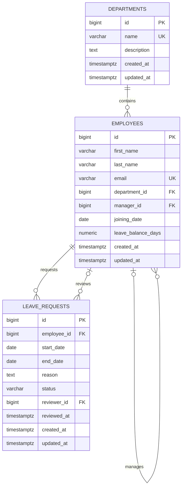

# Initial database ER diagram

```mermaid
erDiagram
    DEPARTMENTS ||--o{ EMPLOYEES : contains
    EMPLOYEES o|--o{ EMPLOYEES : manages
    EMPLOYEES ||--o{ LEAVE_REQUESTS : requests
    EMPLOYEES o|--o{ LEAVE_REQUESTS : reviews

    DEPARTMENTS {
        bigint id PK
        varchar name UK
        text description
        timestamptz created_at
        timestamptz updated_at
    }

    EMPLOYEES {
        bigint id PK
        varchar first_name
        varchar last_name
        varchar email UK
        bigint department_id FK
        bigint manager_id FK
        date joining_date
        numeric leave_balance_days
        timestamptz created_at
        timestamptz updated_at
    }

    LEAVE_REQUESTS {
        bigint id PK
        bigint employee_id FK
        date start_date
        date end_date
        text reason
        varchar status
        bigint reviewer_id FK
        timestamptz reviewed_at
        timestamptz created_at
        timestamptz updated_at
    }
```

The leave-approval rules that require balance and overlap checks are enforced by the future service layer in a transaction, as described in the project README.
